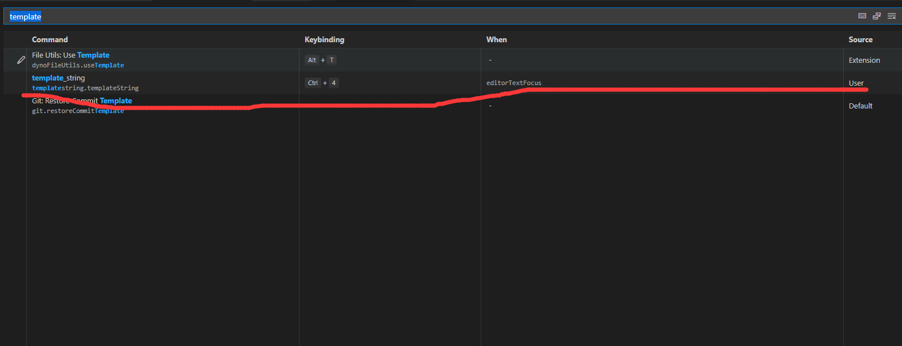

# template_string extension

This extension can allow you use command `template_string` to change text in your template_string as a javascript code.

`variable_name` => `${variable_name}`

## Two Situations

- your selected text is a normal text :
  - variable_name => ${variable_name}
- your selected text is a template_string : 
  - \`variable_name\` => \`${variable_name}\`

**you can bind this extension to your keybinds and it will improve your development exprience.**

